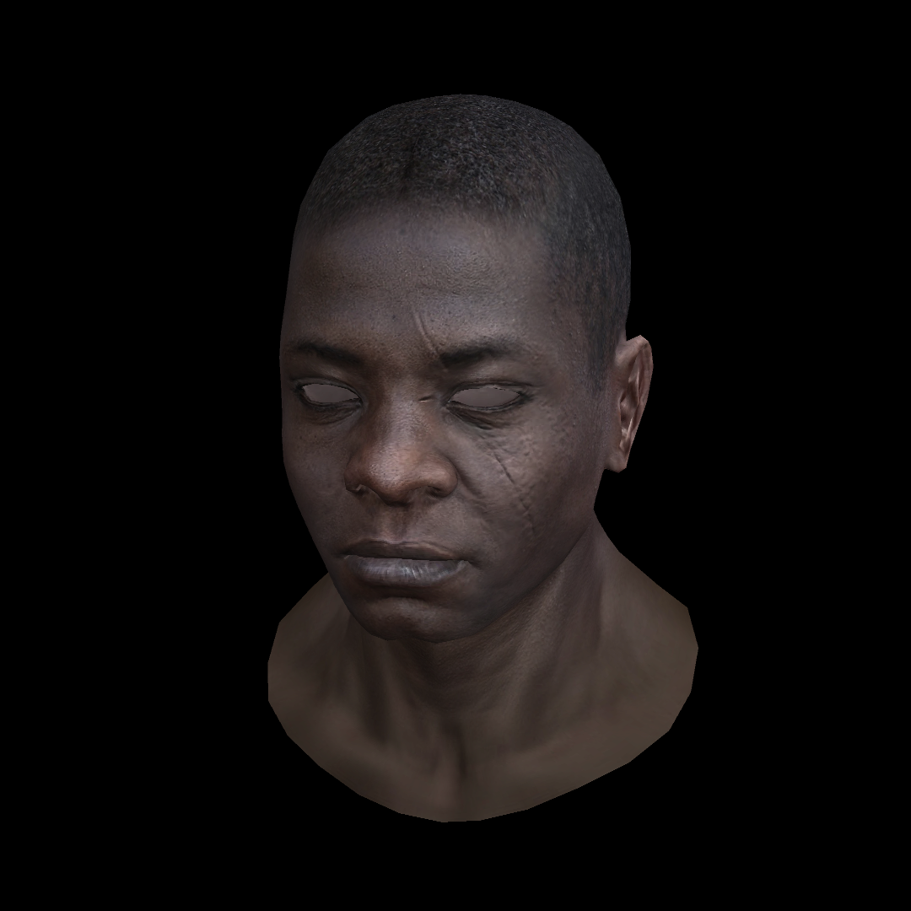

# A Software Rasterizer in C++

A modern graphics pipeline soft rasterized renderer based entirely on CPU implementation, which implements the core algorithms of computer graphics from the bottom up. 

This project does not rely on any graphics API (e.g. OpenGL / DirectX) and aims to achieve 3D graphics rendering through pure mathematical calculations and algorithms, with a deep understanding of every technical detail of the rasterized rendering pipeline.

The implementation of TGA image class and OBJ model parser is based on the [tinyrenderer](https://github.com/ssloy/tinyrenderer) project.

